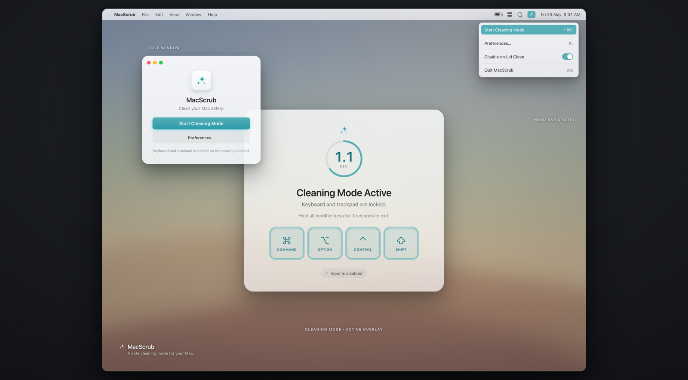

# MacScrub

A calm macOS menu-bar utility that temporarily blocks keyboard and trackpad input so you can wipe down your Mac without triggering anything.



## Features

- **Safe cleaning mode** — blocks all keyboard and trackpad input while you clean.
- **Hold-to-exit** — hold your chosen modifier keys (default ⌘⌥⌃⇧) together for 3 seconds to unlock. A ring fills as you hold.
- **Configurable exit keys** — pick any combination of ⌘ Command, ⌥ Option, ⌃ Control, ⇧ Shift (at least one).
- **Auto-terminate** — cleaning mode ends on its own after an idle timeout (30–300 seconds). The countdown resets whenever a key is pressed, so it only fires once you've truly stopped.
- **Exit on lid open** — optionally end cleaning mode automatically when the laptop lid is opened.
- **Language selection** — System, English, Türkçe, or 中文 (简体), applied on restart.
- **Lives in the menu bar** — no Dock icon; a main window and a native menu give you quick access.
- **Apple-style, calm UI** — a teal accent, frosted-glass overlay, and labelled keycaps.

## Requirements

- macOS 14 Sonoma or later
- Accessibility permission (System Settings → Privacy & Security → Accessibility) — required to block input

## Installation

Download the latest DMG from [Releases](../../releases), drag **MacScrub** to your Applications folder, and open it.

On first launch you may need to right-click → **Open** to bypass Gatekeeper.

## Usage

### Start cleaning

Start from either surface:

- **Main window** — click **Start Cleaning Mode**.
- **Menu bar** — click the ✨ icon, then **Start Cleaning Mode** (⌃⌘C).

The first time, MacScrub asks for **Accessibility** permission. Grant it in System Settings, then start again.

### While cleaning

A full-screen overlay appears and keyboard + trackpad input is blocked. The overlay shows:

- a ring that fills as you hold the exit keys,
- the keycaps you need to hold (lit when pressed),
- an "Input is disabled" indicator.

### Exit cleaning

- **Hold the exit keys** (default ⌘⌥⌃⇧) together for **3 seconds**, or
- **wait for auto-terminate** — the configured idle timeout ends cleaning mode on its own, or
- if **Exit on Lid Open** is enabled, opening the lid ends it.

### Preferences

Open Preferences from the main window (**Preferences…**) or the menu (**Preferences…**, ⌘,):

- **Auto-terminate** — idle timeout, 30–300 seconds.
- **Exit on Lid Open** — toggle.
- **Language** — System / English / Türkçe / 中文.
- **Keys required to exit** — choose which modifiers must be held.

## Building from source

MacScrub uses [XcodeGen](https://github.com/yonaskolb/XcodeGen) to generate its Xcode project from `project.yml`.

```bash
brew install xcodegen          # if not already installed
xcodegen generate              # regenerate MacScrub.xcodeproj from project.yml
open MacScrub.xcodeproj         # build & run in Xcode (⌘R)
```

Run the test suite from the command line:

```bash
xcodebuild test \
  -project MacScrub.xcodeproj \
  -scheme MacScrub \
  -destination 'platform=macOS'
```

Tests use the [Swift Testing](https://developer.apple.com/documentation/testing) framework. Read the result from the `Test run with N tests in M suites passed` summary line (ignore the legacy `Executed 0 tests` line, which refers to XCTest).

## Localization

MacScrub ships in English, Turkish, and Simplified Chinese, stored in a String Catalog at `MacScrub/Localization/Localizable.xcstrings`.

Want to add your language? See **[docs/ADDING_A_TRANSLATION.md](docs/ADDING_A_TRANSLATION.md)** for a step-by-step guide.

## License

MacScrub is released under the [MIT License](LICENSE).
